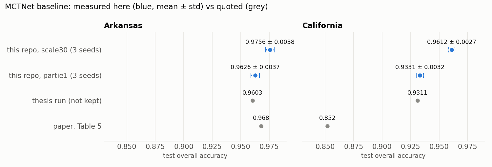
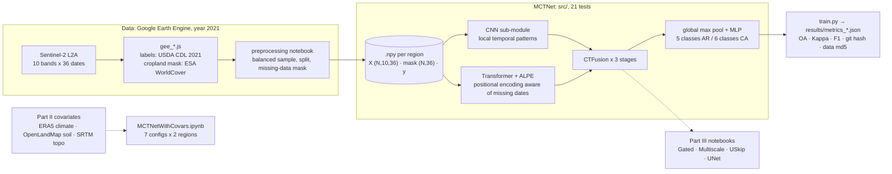

# Crop Classification: reproducing MCTNet

Team reproduction of MCTNet (Wang et al., 2024), a lightweight CNN-Transformer for pixel-level
crop mapping from Sentinel-2 time series (Arkansas, California), followed by an environmental
covariate ablation and three architectural variants. The baseline is **re-run from this
repository, 3 seeds × 2 regions, every number traced to a versioned `metrics.json`**.

M1 project, USTHB (Algiers), April to May 2026, delivered with a LaTeX report (`rapport/`).
Team: Arslan Dif, Tesnime Ziane Berroudja, Sarah Acherouf Kebir.

## Problem → Result

Wang et al. report 0.968 overall accuracy (OA) in Arkansas and 0.852 in California. They use
a CNN branch for local temporal patterns, a Transformer branch for global ones, and ALPE, a
positional encoding that knows which dates are missing because of clouds. The assignment
was to rebuild the model from the paper, collect the data again on Google Earth Engine, and
test whether soil, climate and topography covariates help.



| MCTNet, test set | Arkansas OA | California OA | source |
|---|---|---|---|
| this repo, `scale30` data (default) | 0.9756 ± 0.0038 | 0.9612 ± 0.0027 | [results/](Partie%20I%20%E2%80%94%20Reproduction%20MCTNet/Point%205%20%E2%80%94%20Model%20Implementation/results) |
| this repo, `partie1` data | 0.9626 ± 0.0037 | 0.9331 ± 0.0032 | [results/partie1/](Partie%20I%20%E2%80%94%20Reproduction%20MCTNet/Point%205%20%E2%80%94%20Model%20Implementation/results/partie1) |
| thesis run (logs not kept) | 0.9603 | 0.9311 | `rapport/chapters/partie1.tex` |
| paper, Table 5 | 0.968 | 0.852 | Wang et al. 2024, p. 7 |

Mean ± std over seeds 42/43/44, CPU; `scale30` runs at commit `ec7cf7e`, `partie1` runs at
`6ed7183` (same `train.py`). Kappa, macro-F1, the
confusion matrices ([docs/confusion_scale30.png](docs/confusion_scale30.png)) and the
per-epoch history are in the same files. Each file also records its git commit and the md5 of
every `.npy` it read.

What these numbers say, and what they do not:

- **The thesis baseline is reproduced on the `partie1` variant.** All six thesis values (OA,
  Kappa, F1 × 2 regions) fall inside the seed range. On `scale30`, another preprocessing
  variant with a different test split, the model gains 1.3 to 2.8 points: **choosing the preprocessing variant moved
  the number more than any architectural change measured in Part III did.**
- **This is not a like-for-like comparison with the paper.** The training sets are small,
  balanced samples (240 pixels per class, 1,200 in Arkansas and 1,440 in California) with
  8,200 to 8,500 test pixels, collected by us over our own zones. Being 11 points above the
  paper in California says that the data differ, not that the model is better.
- **Single-split, small-sample results.** The seed-to-seed standard deviation (≈ 0.003–0.004
  OA) is the same order of magnitude as most deltas below.

The LaTeX report was produced from earlier runs whose logs were not kept. Where it differs
from the versioned notebooks or metrics files, this README quotes the versioned files.

## My contribution

| Member | Main role |
|---|---|
| Arslan Dif ([@D-Arslan](https://github.com/D-Arslan)) | Part I: ALPE + Transformer, MCTNet assembly, `train.py` · Part III: GatedMCTNet, MCTNetUSkip, UNetMCTNetWithCovars |
| Tesnime Ziane Berroudja ([@qutabaree12](https://github.com/qutabaree12)) | Part I: CNN sub-module · Part II: MCTNetWithCovars · Part III: MCTNet Multiscale |
| Sarah Acherouf Kebir ([@Sarah-AK-20](https://github.com/Sarah-AK-20)) | Part I: data preprocessing · Part II: environmental covariate preprocessing |

My part of the model is [`transformer_alpe.py`](Partie%20I%20%E2%80%94%20Reproduction%20MCTNet/Point%205%20%E2%80%94%20Model%20Implementation/src/transformer_alpe.py)
(ALPE and the Transformer sub-module), the assembly into
[`mctnet.py`](Partie%20I%20%E2%80%94%20Reproduction%20MCTNet/Point%205%20%E2%80%94%20Model%20Implementation/src/mctnet.py)
with its tests, and the training script. After delivery, I made the baseline reproducible:
seeded runs, `metrics.json` with provenance, the diagnosis of the gap between the thesis and
`scale30`, and the correction of the paper's reference values (see Design decisions).

## Part II and III results

All single runs from Colab notebooks, with their outputs versioned. Deltas are given only
against a baseline on the same data variant.

| Experiment | Data variant | Arkansas OA | California OA | Status |
|---|---|---|---|---|
| Covariates, best config ([notebook](Partie%20II%20%E2%80%94%20Covariables%20Environnementales/src/MCTNetWithCovars.ipynb)) | Part II pipeline | 0.9799 (clim+topo) | 0.9423 (clim+soil) | see note 1 |
| UNetMCTNetWithCovars, best ([notebook](Partie%20III%20%E2%80%94%20Contributions/unet/notebooks/UNetMCTNetWithCovars.ipynb)) | Part II pipeline | 0.9785 (soil+topo) | 0.9395 (all) | see note 1 |
| MCTNetUSkip ([notebook](Partie%20III%20%E2%80%94%20Contributions/uskip/notebooks/MCTNetUSkip.ipynb)) | `partie1` | 0.9637 (+0.34 pt) | 0.9283 (−0.28 pt) | see note 2 |
| MCTNet Multiscale, 200 epochs ([notebook](Partie%20III%20%E2%80%94%20Contributions/multiscale/notebooks/MCTNetMultiscale.ipynb)) | `partie1`-sized | 0.9668 (+0.65 pt) | 0.9322 (+0.11 pt) | cited in the thesis |
| MCTNet Multiscale, early stopping (same notebook) | `partie1`-sized | 0.9640 (+0.37 pt) | 0.9233 (−0.78 pt) | same protocol as the baseline |
| GatedMCTNet | `partie1` | 0.9695 | 0.9237 | reported in the thesis, not reproducible from this repository |

Deltas are relative to the thesis baseline run (0.9603 / 0.9311).

1. **Covariates and UNet were run on a different preprocessing pipeline; no same-data baseline
   exists in this repository, so the covariate gain reported in the thesis is neither
   confirmed nor refuted here.** The full 7-config × 2-region table is in the notebook. The
   thesis table (`partie2.tex`) differs from it on all 14 values; it comes from an earlier run.
2. **MCTNetUSkip (50,842 params) adds 11,124 parameters to the 4×C-FFN MCTNet variant it is
   built on (39,718); the thesis's "−5,956 vs MCTNet" compares against the 8×C variant and is
   not like-for-like.**
3. **Multiscale** (variant inferred from test-set size): the thesis cites the 200-epoch run
   without early stopping. The two scripts
   the notebook calls (`train_visu.py`, `train_early.py`) are not in the repository.
4. **GatedMCTNet:** the notebook has no saved outputs. The architecture is tested
   (+4,270 parameters over MCTNet, [`test_gated_mctnet.py`](Partie%20I%20%E2%80%94%20Reproduction%20MCTNet/Point%205%20%E2%80%94%20Model%20Implementation/tests/test_gated_mctnet.py)).
   It can be trained with `train.py --model gated`, but no run is versioned.

## Architecture



Static copy: [docs/architecture.svg](docs/architecture.svg). Solid lines are the path that
runs from this repository (`train.py`); dotted lines exist only as Colab notebooks. Each
CTFusion stage halves the time axis and doubles the channels: (10, 36) → (20, 18) → (40, 9) →
(80, 4).

## Stack

| layer | tools |
|---|---|
| data | Google Earth Engine (JavaScript), Sentinel-2 SR harmonized, USDA CDL 2021, ESA WorldCover; ERA5, OpenLandMap, SRTM for Part II |
| model and training | Python 3.12, PyTorch 2.10 (CPU locally; CUDA on Colab for the notebooks), scikit-learn metrics |
| experiments | Jupyter on Google Colab (Parts II and III) |
| quality | pytest, 21 offline tests on the model (stage shapes, ALPE mask, parameter counts, gate values) |
| report | LaTeX (`rapport/`), compiled PDF `rapport/rapport_final.pdf` |

## Getting started in 3 commands

```bash
git clone https://github.com/D-Arslan/crop-classification.git && cd crop-classification && pip install -r requirements.txt
cd "Partie I — Reproduction MCTNet/Point 5 — Model Implementation" && python -m pytest -q   # 21 tests, a few seconds
python train.py --region Arkansas --seed 42    # needs data/preprocessed/scale30/*.npy, ~1.5 min on CPU
```

What you get, honestly:

- **The tests run anywhere** and need no data.
- **The data are not distributed** (team Google Drive). To rebuild them:
  1. run the [GEE scripts](Partie%20I%20%E2%80%94%20Reproduction%20MCTNet/Point%202%20%E2%80%94%20Dataset%20Acquisition)
     to export one CSV per zone;
  2. run `merge_and_subsample.py`;
  3. run `Point 4/preprocessing_30.ipynb`, which produces `{region}_{split}_{input1,input2,labels}.npy`;
     place them in `data/preprocessed/scale30/`.

  For Part II, use `Partie II/data/preprocessing_Part2.ipynb`. The notebooks contain the
  team's Drive paths; edit them before running. A fresh export will not give byte-identical
  `.npy` files; the md5 values in `metrics.json` identify the ones used here.
- **Since 2026-10-01, `--model` defaults to `mctnet`.** Before that, `python train.py`
  trained GatedMCTNet. Use `--model gated` for the variant.

## Repository layout

```
crop-classification/
├── Partie I — Reproduction MCTNet/
│   ├── Point 1–4/                 # literature notes, GEE scripts, exploration, preprocessing notebooks
│   └── Point 5 — Model Implementation/
│       ├── src/                   # transformer_alpe, cnn_submodule, ctfusion, mctnet (+ GatedMCTNet)
│       ├── tests/                 # 21 pytest cases
│       ├── train.py               # seeded training, writes results/metrics_*.json
│       ├── results/               # versioned metrics: scale30 (root) and partie1/
│       └── docs/                  # internal working notes (French, April 2026)
├── Partie II — Covariables Environnementales/   # covariate preprocessing + ablation notebook
├── Partie III — Contributions/    # gated/, multiscale/, uskip/, unet/
├── docs/                          # DESIGN.md, figures, make_figures.py, architecture.svg
├── scripts/export_diagram.py      # README Mermaid -> docs/architecture.svg
├── rapport/                       # LaTeX report as delivered (not modified) + rapport_final.pdf
└── archive/                       # delivered zip, drafts
```

Folder names are in French, as delivered: Partie = Part, Covariables = covariates.

## Design decisions and trade-offs

- **FFN width 8×C.** The paper does not give it. 8×C gives 56,798 parameters for 55,059 in
  the paper (+3%), while 4×C gives 39,718. California has 81 more parameters (56,879): the
  output layer is `Linear(80 → n_classes)`, and one more class adds 80 weights + 1 bias.
- **Model selection on validation macro-F1**, not OA. The California test set is unbalanced
  (rice 41%, pistachios 6%), which is why its F1 (0.9419) sits below its OA (0.9612).
- **Documented deviations from the paper's training**: weight decay 1e-4,
  `ReduceLROnPlateau`, early stopping (patience 20). All three were added on 2026-05-09,
  before delivery.
- **The paper's targets, checked against the PDF.** The thesis compares its baseline with
  0.9598 / 0.9502 attributed to the paper. Those values do not appear in it; Table 5 says
  0.968 / 0.852.
- **Numbers come from files, not from memory.** `train.py` writes the metrics, the confusion
  matrix, the history and the provenance. `docs/make_figures.py` reads only those files, plus
  two quoted rows, with their source written next to them.

Details: [docs/DESIGN.md](docs/DESIGN.md).

## Limits and next steps

- **Part II and III are single runs** without seeds. Most of their deltas are within the
  baseline's seed noise.
- **No same-data baseline for the covariates.** Running MCTNet on the Part II `.npy` would
  settle the question; those files are not in this repository.
- **Small balanced samples**, one year (2021), our own zones: no claim transfers to
  wall-to-wall mapping.
- **Notebooks are tied to Colab and Drive paths**, and two Multiscale scripts are missing.
- **No CI yet.** The 21 tests are fast and offline; a workflow is the next step.

## Author

Arslan Dif, M2 distributed systems and data science. Team project with Tesnime and Sarah
(USTHB, M1 2025–2026). Related work: [TerraOps](https://github.com/D-Arslan/terraops) (MLOps
platform with a measured drift monitor), [TerraOps Copilot](https://github.com/D-Arslan/terraops-copilot)
(LLM agent with tools, evaluated against ground truth), [UrbanFlow](https://github.com/D-Arslan/UrbanFlow)
(real-time Vélib' pipeline, Kafka / Spark / XGBoost), [CROUS Sentinel](https://github.com/D-Arslan/crous-sentinel)
(unattended housing-alert bot and its post-mortem).
